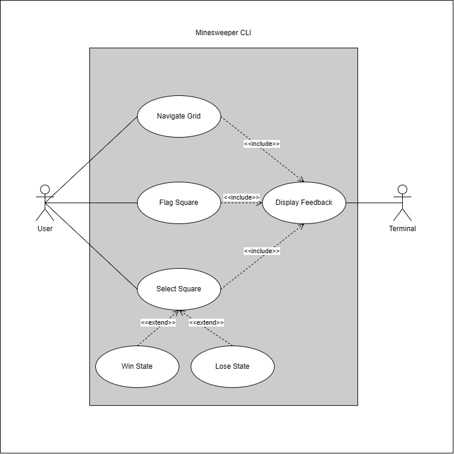
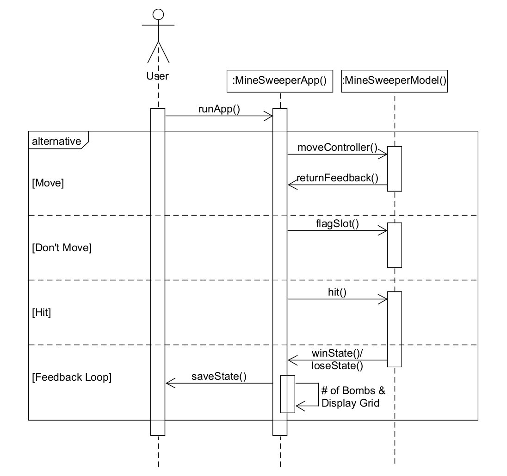
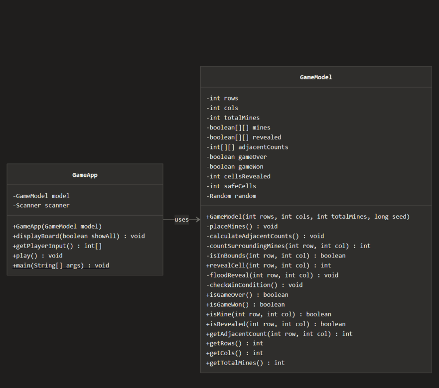

# 💣 MineSweeper CLI - Report

## 1. Introduction
This project focuses on the development of a command-line Minesweeper application designed to apply structured software engineering and testing principles. The system is implemented using test-driven development and follows the Model–View–Controller architecture to ensure testability. Minesweeper was selected due to its clear rules and state-based logic, making it suitable for verification. The following sections will describe the design constraints, development process, implementation approach, and testing strategy used in this project.

## 2. Design Problem
### 2.1 Problem Definition
The objective of this project is to design and implement a command-line version of **MineSweeper**. It aims to successfully test and validate all core mechanics of the game. The project will correctly handle grid generation, random mine placements, user inputs and state transitions in a deterministic manner. It will prioritize the use of the MVC architecture, separating code cleanly making debugging and editing simpler and straightforward. The end product will focus more on reliability and sustainability more than graphical complexity.

### 2.2 Design Requirements
#### 2.2.1 Functions
* Displaying an m x n minefield grid.
* Select a spot on the grid.
* Display numbers based on how many mines surround a particular spot.
* Detect and switch to Win / Playing / Loss states. 

#### 2.2.2 Objectives
* Maintain clear adherence to the Model View Controller (MVC) architecture
* Support TDD - Test Driven Development and well-defined test cases.
* Provide a simple and easy to navigate interface for the game.

#### 2.2.3 Constraints
| Constraint | Satisfiable? |
|-----------------------------|----------|
| Needs to operate exclusively on the command line | Yes |
| Should use Model-View-Controller architecture | Yes |
| Include automated **unit** testing using JUnit | Yes |
| Produce deterministic game behavior and results | Yes |
| Fully executable on a standard Java environment | Yes |

## 3. Solution

Throughout the design process, our team brainstormed multiple architectural approaches for the MineSweeper CLI application. Each iteration was evaluated primarily on **testability**, along with adherence to our design constraints (MVC architecture, deterministic behavior, JUnit compatibility, and CLI-only operation). The following subsections document our design evolution and the reasoning behind each iteration.

### 3.1 Solution 1: Monolithic Single-Class Design

Our initial approach placed all game logic, rendering, and input handling into a single `MineSweeper.java` class. The grid was represented as a 2D integer array, mines were placed using `Math.random()` directly in the constructor, and `System.out.println()` calls were embedded throughout the game logic methods. User input was read via a `Scanner` attached to `System.in` inside the main game loop.

**Architecture Overview:**

```
┌─────────────────────────────┐
│       MineSweeper.java      │
│  ┌───────────────────────┐  │
│  │ Grid + Mine Placement │  │
│  │ Game State Logic      │  │
│  │ Display / Rendering   │  │
│  │ Input Handling        │  │
│  │ Win/Loss Detection    │  │
│  └───────────────────────┘  │
└─────────────────────────────┘
```

**Why this solution was not selected (testing limitations):**

While this approach was quick to prototype, it presented significant obstacles from a testing perspective:

1. **Non-deterministic mine placement:** Using `Math.random()` directly meant that each run produced a different board layout. This made it impossible to write repeatable JUnit assertions, since expected outputs could not be predetermined.
2. **Tightly coupled I/O:** Because `System.out` and `Scanner(System.in)` were embedded in the logic methods, unit tests could not isolate the game model from the view. Testing any game rule required simulating console I/O, which added unnecessary complexity and fragility.
3. **No separation of concerns:** With everything in one class, it was not possible to independently test individual components such as mine counting, cell revealing, or win/loss detection. A bug in rendering could mask a bug in game logic, and vice versa.
4. **Path and data flow testing difficulty:** Since methods handled multiple responsibilities (e.g., a `revealCell()` method that both updated state and printed output), constructing clean control flow graphs for path testing was impractical. Data flow analysis was similarly hindered because variables served dual purposes across logic and presentation.

| Evaluation Criteria          | Rating     | Notes                                       |
|------------------------------|------------|---------------------------------------------|
| Unit test isolation          | Poor       | Cannot test model without triggering I/O    |
| Deterministic test cases     | Poor       | Random mine placement prevents repeatability|
| Path testing feasibility     | Poor       | Methods mix logic with side effects         |
| MVC compliance               | Not met    | All code resides in a single class          |
| Integration test clarity     | Poor       | No distinct units to integrate              |

This evaluation made it clear that a fundamental architectural restructuring was needed before any meaningful test suite could be designed.

---

### 3.2 Solution 2: Partial MVC with Separated Model

Building on the shortcomings of Solution 1, our second iteration introduced a basic separation between the game model and the rest of the application. We created two classes: `GameModel.java` (containing the grid, mine placement, and game state logic) and `GameApp.java` (handling rendering and user input together).

Mine placement was improved by accepting a `java.util.Random` object as a constructor parameter, allowing a seeded random number generator to be injected during testing. This resolved the determinism problem identified in Solution 1.

**Architecture Overview:**

```
┌──────────────────┐      ┌──────────────────────┐
│  GameModel.java  │◄─────│    GameApp.java       │
│                  │      │                       │
│ - grid[][]       │      │ - Scanner input       │
│ - mines[][]      │      │ - System.out display  │
│ - gameState      │      │ - Game loop           │
│ - revealCell()   │      │ - Input parsing       │
│ - countMines()   │      └──────────────────────┘
│ - checkWin()     │
│ - Random seed    │
└──────────────────┘
```

**Improvements over Solution 1:**

- **Deterministic testing enabled:** By injecting a seeded `Random` object, the same board layout could be reproduced across test runs. This allowed us to write JUnit assertions with known expected values.
- **Model is independently testable:** Methods like `revealCell()`, `countMines()`, and `checkWin()` could now be called in JUnit tests without any console interaction.
- **Path testing became feasible:** With game logic isolated in `GameModel`, we could draw control flow graphs for individual methods and identify independent paths for path coverage testing.

**Use Case, Sequence, and Class Diagrams for Solution 2**

<p align="center">
  
</p>
<p align="center"><em>Figure 1: Use Case Diagram</em></p>

<br>

<p align="center">
  
</p>
<p align="center"><em>Figure 2: Sequence Diagram</em></p>

<p align="center">
  
</p>
<p align="center"><em>Figure 3: Class Diagram</em></p>

**Why this solution was still not selected (remaining testing limitations):**

1. **View and Controller still coupled:** `GameApp.java` combined both rendering and input handling. This meant that validating display correctness (e.g., does the grid render properly after a reveal?) still required simulating `System.in`, and testing input parsing required capturing `System.out`. These two concerns could not be tested independently.
2. **Integration testing gaps:** With only two classes, integration testing was limited to the interface between `GameModel` and `GameApp`. A proper MVC separation would provide three distinct units (Model, View, Controller) with well-defined interfaces, enabling more comprehensive integration tests between each pair.
3. **Boundary value and equivalence class testing for input:** Input validation logic was buried inside `GameApp.java` alongside rendering code. Performing equivalence class testing and boundary value testing on user input (e.g., row/column values at grid edges, negative numbers, non-integer entries) required instantiating the entire application rather than testing the input-handling unit in isolation.
4. **State transition testing complexity:** While the model tracked game states (Playing, Won, Lost), the transitions were partially triggered by `GameApp.java` logic. This split responsibility made it harder to design clean state transition test cases, since the state machine was distributed across two classes.

| Evaluation Criteria          | Rating     | Notes                                            |
|------------------------------|------------|--------------------------------------------------|
| Unit test isolation          | Good       | Model is testable; View+Controller are not       |
| Deterministic test cases     | Good       | Seeded Random resolves repeatability             |
| Path testing feasibility     | Good       | Clean control flow in model methods              |
| MVC compliance               | Partial    | Only M is separated; V and C are merged          |
| Integration test clarity     | Fair       | Only one integration boundary (Model ↔ App)      |
| Boundary/equivalence testing | Fair       | Input validation not independently testable      |
| State transition testing     | Fair       | State machine split across two classes           |

**Comparison of Solution 1 and Solution 2:**

| Criteria                     | Solution 1 (Monolithic) | Solution 2 (Partial MVC) |
|------------------------------|:-----------------------:|:------------------------:|
| Deterministic tests          | ✗                       | ✓                        |
| Isolated model testing       | ✗                       | ✓                        |
| Isolated view testing        | ✗                       | ✗                        |
| Isolated controller testing  | ✗                       | ✗                        |
| Path testing feasibility     | ✗                       | ✓                        |
| Data flow testing feasibility| ✗                       | ✓                        |
| Integration test boundaries  | 0                       | 1                        |
| MVC compliance               | ✗                       | Partial                  |

This analysis demonstrated that while Solution 2 was a substantial improvement, achieving full testability across all required testing techniques (path testing, data flow, integration testing, boundary value, equivalence class, decision table, state transition, and use case testing) required a complete MVC separation. This insight directly informed the design of our final solution (Section 3.3).

## Team Members

<div align="center">

| Name                     | Student ID |
|--------------------------|------------|
| Glen Issac               | 200499313  |
| Shivam Jigneshbhai Soni  | 200474721  |
| Luka Dundjerovic         | 200494589  |

</div>
